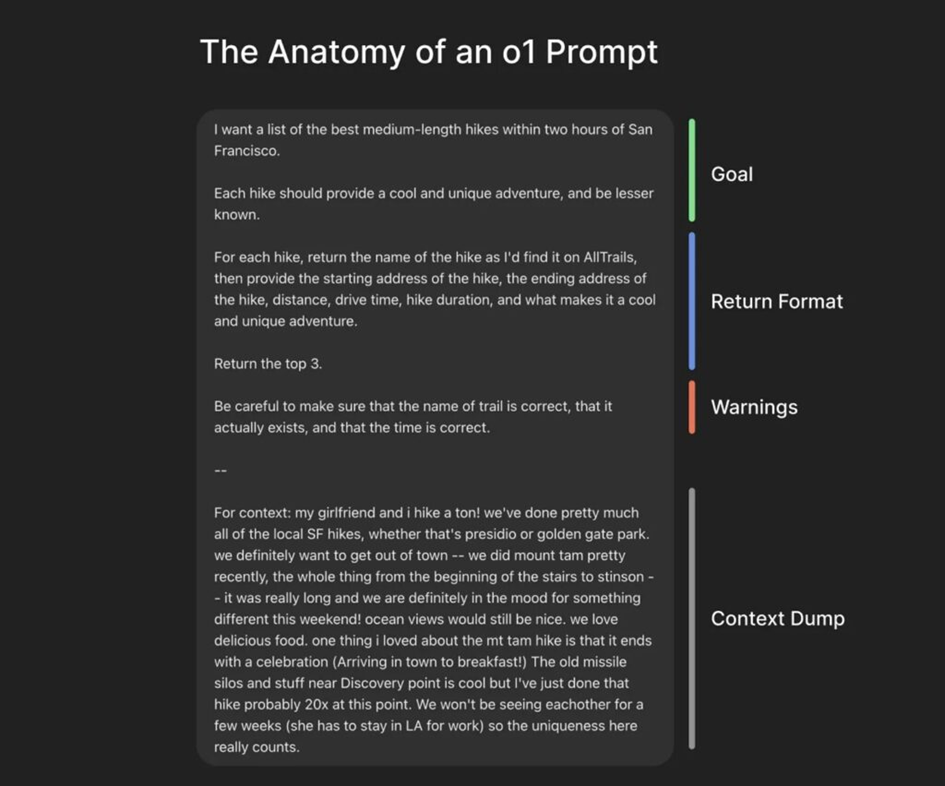

# Dokumentation: Zielgerichteter Einsatz von KI in der Webentwicklung  

## 1. Einleitung  

Künstliche Intelligenz dominiert zunehmend die Code-Entwicklung und verändert den Beruf von Informatikerinnen und Informatikern stark. Dadurch wird es immer wichtiger, den Umgang mit KI zu erlernen und sie effizient einzusetzen.  

Mit meinem Projekt verfolgte ich das Ziel, KI-gestützte Entwicklungsumgebungen gezielt zur Codegenerierung, Problemlösung und Projektunterstützung einzusetzen und ihren Nutzen im Entwicklungsprozess zu untersuchen.

---

## 2. Verwendete KI-Tools  

Im Rahmen des Projekts setzte ich folgende KI-Tools ein:

- Claude
- Gemini Pro in Kombination mit der KI-IDE Antigravity  

---

## 3. Einstieg in die Arbeit mit KI  

Zu Beginn der Entwicklung nutzte ich Claude, um eine erste Version der Webseite zu erstellen. Das Tool überzeugte mich durch seine Fähigkeit, schnell qualitativ hochwertigen und funktionierenden Code zu generieren.  

Allerdings stellte ich im praktischen Einsatz einen wesentlichen Nachteil fest: Der hohe Tokenverbrauch schränkte meine langfristige Nutzung erheblich ein. Dadurch eignete sich das Tool vor allem für kürzere, intensive Arbeitsphasen.

Im weiteren Verlauf wechselte ich zu Antigravity in Kombination mit Gemini Pro. Diese Umgebung ermöglichte mir ein deutlich stabileres und nachhaltigeres Arbeiten über längere Zeiträume hinweg.  

Dabei erkannte ich jedoch, dass die Qualität der Ergebnisse stark von der Präzision meiner Eingaben abhängt. Im Gegensatz zu Claude liefert dieses System nicht automatisch optimale Resultate, sondern fordert von mir klar strukturierte und detaillierte Prompts.

---

## 4. Einsatz von KI im Entwicklungsprozess  

### 4.1 Codegenerierung und Problemlösung  
Ich setzte die KI gezielt ein, um:
- Grundstrukturen der Webseiten zu erstellen  
- Funktionen effizient zu generieren  
- Fehler zu identifizieren und Lösungsvorschläge zu entwickeln  

Dadurch beschleunigte ich den Entwicklungsprozess deutlich. Gleichzeitig musste ich die generierten Ergebnisse kritisch überprüfen und anpassen.

---

### 4.2 Prompt Engineering als zentrale Kompetenz  
Ein zentraler Bestandteil meiner Arbeit war das sogenannte *Prompt Engineering*.  

Dabei legte ich den Fokus darauf:
- präzise und strukturierte Anweisungen zu formulieren  
- komplexe Anforderungen verständlich zu beschreiben  
- die Ergebnisqualität durch iterative Verbesserung der Prompts zu steigern  

Ich stellte fest, dass die Qualität der KI-Ergebnisse direkt mit der Qualität meiner Eingaben zusammenhängt. Gut formulierte Prompts lieferten mir deutlich bessere und effizientere Resultate. Als Hilfe nutzte ich dieses Bild.

---

### 4.3 Layout, Design und UI-Optimierung  
Neben der technischen Umsetzung nutzte ich KI auch für gestalterische Aspekte. Dazu gehörten:
- Entwicklung moderner Layouts  
- Verbesserung der Benutzerführung (UX)  
- Umsetzung visueller Effekte und Interaktionen  

Um die KI-generierten Vorschläge zu ergänzen, griff ich auf externe Inspirationsquellen zurück, unter anderem:

- [Apple](https://www.apple.com/) als Referenz für hochwertiges Webdesign  
- [Dribbble](https://dribbble.com/) zur Analyse und Planung von UI-Strukturen  
- Webseiten mit fortgeschrittenen Animationen (z. B. 3D-Transformationen)  

Indem ich KI-Unterstützung mit bestehenden Designbeispielen kombinierte, erzielte ich deutlich bessere Ergebnisse.

---

## 5. Vergleich der eingesetzten KI-Tools  

### 5.1 Bewertungskriterien  
Für den Vergleich definierte ich folgende Kriterien:
- Qualität der Codegenerierung  
- Effizienz und Ressourcenverbrauch  
- Benutzerfreundlichkeit  
- Abhängigkeit von Prompt-Qualität  
- Eignung für langfristige Projekte  

---

### 5.2 Vergleichstabelle  

| Kriterium | Claude Code | Antigravity (mit Gemini Pro) |
| :--- | :--- | :--- |
| **Entwickler** | Anthropic | Google |
| **Art** | KI-Coding-Tool | KI-IDE |
| **Codequalität** | Sehr hoch | Sehr hoch |
| **Tokenverbrauch** | Hoch | Gering |
| **Prompt-Abhängigkeit** | Gering | Hoch |
| **Arbeitsweise** | Schnell und direkt | Strukturiert und nachhaltig |
| **Eignung** | Kurzfristige Aufgaben | Langfristige Projekte |

---

### 5.3 Interpretation des Vergleichs  
Meine Analyse zeigt, dass beide Tools unterschiedliche Stärken besitzen:  

- Ich setze Claude besonders für eine schnelle, qualitativ hochwertige Codegenerierung ein, da ich dafür nur geringen Aufwand bei der Eingabe benötige.  
- Gemini Pro in Antigravity unterstützt mich hingegen besser beim kontinuierlichen Arbeiten, fordert von mir jedoch deutlich mehr Präzision im Umgang mit Prompts.  

Indem ich beide Ansätze kombiniere, erreiche ich eine besonders effiziente Arbeitsweise.

---

## 6. Eigene Rolle und Arbeitsweise  

Ich konzentrierte mich bei meiner Hauptaufgabe im Projekt nicht primär auf das klassische Programmieren, sondern darauf, die KI-Systeme effektiv zu nutzen und zu steuern.  

Dabei übernahm ich insbesondere folgende Aufgaben:
- das gezielte Formulieren von Prompts  
- die Bewertung und Anpassung der generierten Ergebnisse  
- die Integration von Inspirationen in meine eigene Umsetzung  

Ich nahm damit verstärkt die Rolle als **Steuerungseinheit zwischen Mensch und KI** ein, die für mich eine neue Form der Entwicklungsarbeit darstellt.

---

## 7. Fazit  

Durch meinen zielgerichteten Einsatz von Künstlicher Intelligenz veränderte und beschleunigte ich den gesamten Entwicklungsprozess deutlich. Besonders im Bereich der Codegenerierung und Problemlösung nutzte ich die KI als sehr leistungsfähiges Werkzeug, das mich bei komplexen Aufgaben in kurzer Zeit effektiv unterstützte.  

Gleichzeitig erkannte ich, dass ich präzise und durchdachte Prompts formulieren muss, damit die KI gute Ergebnisse liefert. Ohne meine klaren Anweisungen sinkt die Qualität der Ergebnisse erheblich.  

Insgesamt beweise ich mit diesem Projekt, dass wir KI nicht als Ersatz für Entwickler betrachten dürfen, sondern als Ergänzung einsetzen müssen, die unseren Entwicklungsprozess effizienter und strukturierter macht. Mein bewusster und reflektierter Umgang mit der KI sicherte dabei die Qualität des Endprodukts.

---

## 8. Reflexion  

Im Verlauf des Projekts lernte ich, dass meine Arbeit mit KI weit über das reine Generieren von Code hinausgeht. Besonders wichtig empfand ich die Erkenntnis, dass ich als Entwickler zunehmend die **Steuerung und Kontrolle von KI-Systemen** übernehmen muss.  

Besonders beim sogenannten Prompt Engineering lernte ich viel dazu. Ich stellte fest, dass ich bereits durch kleine Unterschiede in meiner Formulierung grosse Auswirkungen auf die Qualität der Ergebnisse erzielen kann. So verbesserte ich meine Fähigkeit, spezielle Anforderungen klar, strukturiert und zielgerichtet zu formulieren.  

Zudem lernte ich, verschiedene KI-Tools gezielt nach ihren Stärken einzusetzen. Ich nutze einige Tools besonders für schnelle Ergebnisse, während ich andere besser in meine langfristigen und strukturierten Entwicklungsprozesse einbinde.  

Kritisch betrachtet verlasse ich mich jedoch nicht blind auf die KI, da sie nicht immer zuverlässig arbeitet. Ich überprüfe, verstehe und passe die Ergebnisse stets manuell an. Erst indem ich meine KI-Unterstützung mit meinem eigenen Fachwissen kombiniere, erreiche ich qualitativ hochwertige Resultate.  

Für zukünftige Projekte nehme ich mir vor, KI weiterhin bewusst, reflektiert und zielgerichtet einzusetzen, da ich dies als entscheidenden Faktor für meine effiziente und professionelle Softwareentwicklung ansehe.  

**Als Anmerkung möchte ich noch sagen, dass KI kein Ersatz für einen Informatiker ist. Ich bin der Meinung, dass sich der Beruf des Informatikers vielmehr verändern wird, als dass er ersetzt wird. Gleichzeitig werden neue Berufsfelder entstehen, die stark mit KI zu tun haben. Ich stelle mir diese Entwicklung ähnlich vor wie während der Industrialisierung, bei der sich Arbeitsprozesse grundlegend verändert haben und neue Berufsbilder entstanden sind.**
