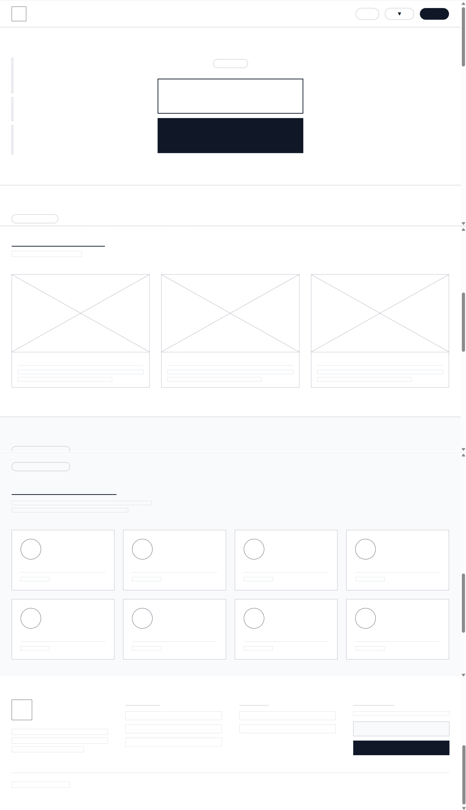
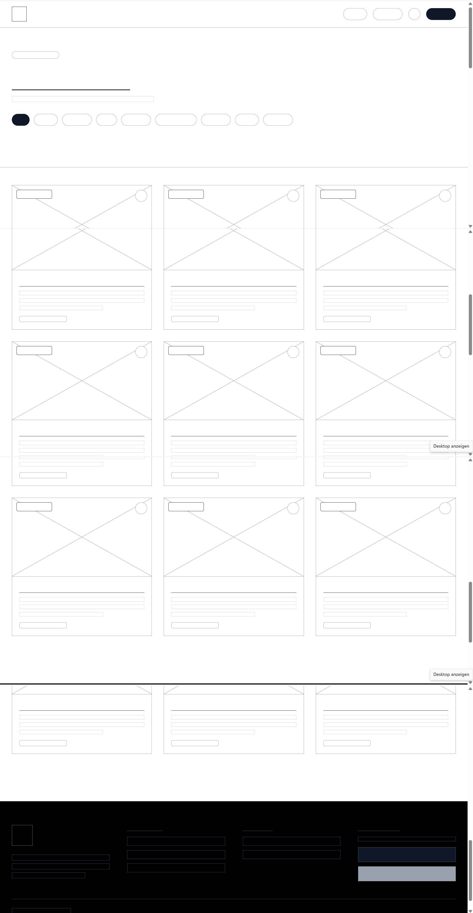
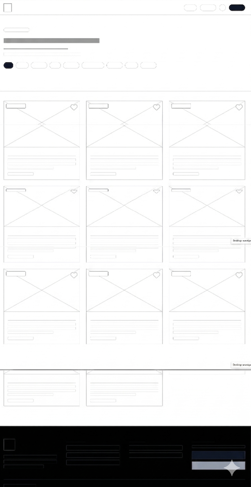
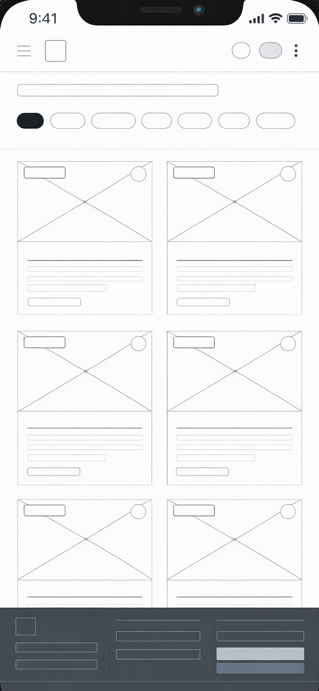
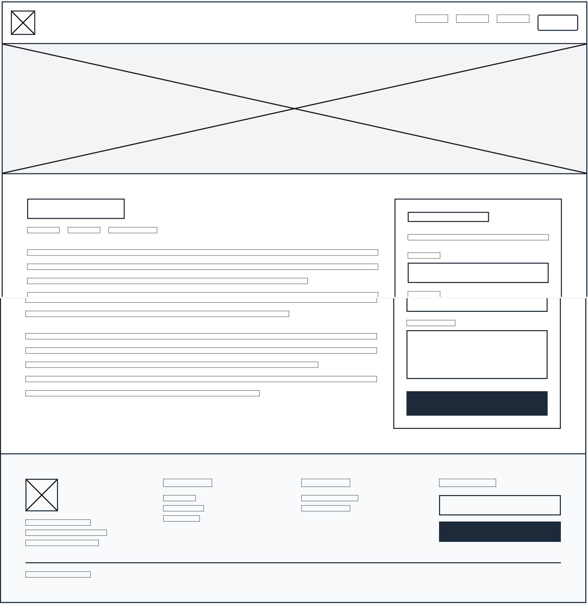
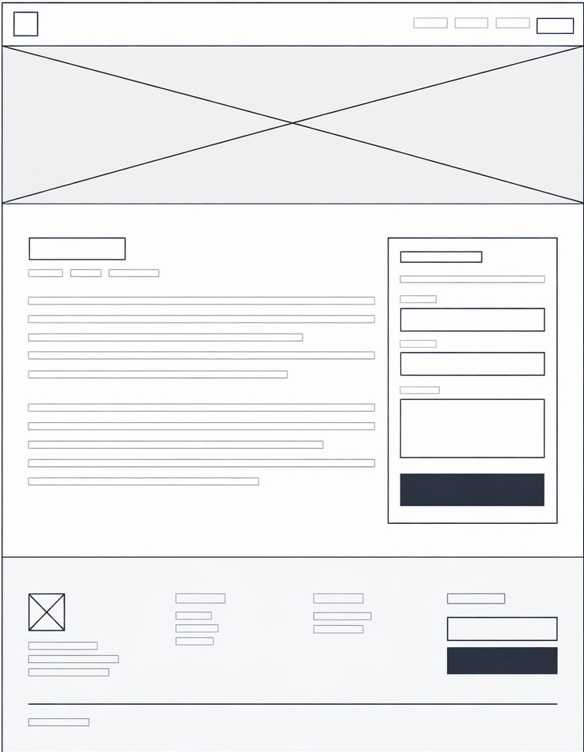
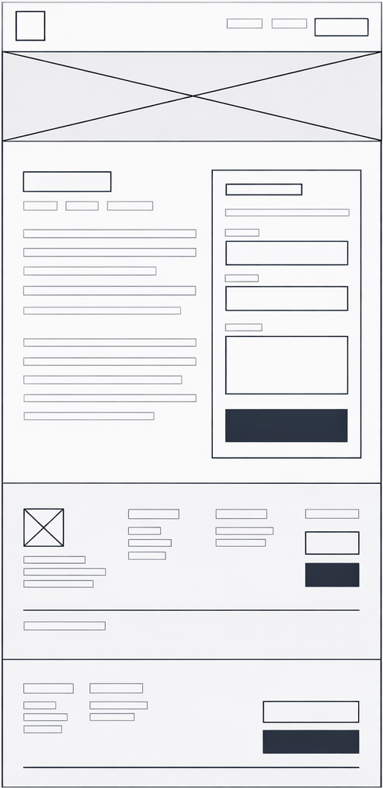
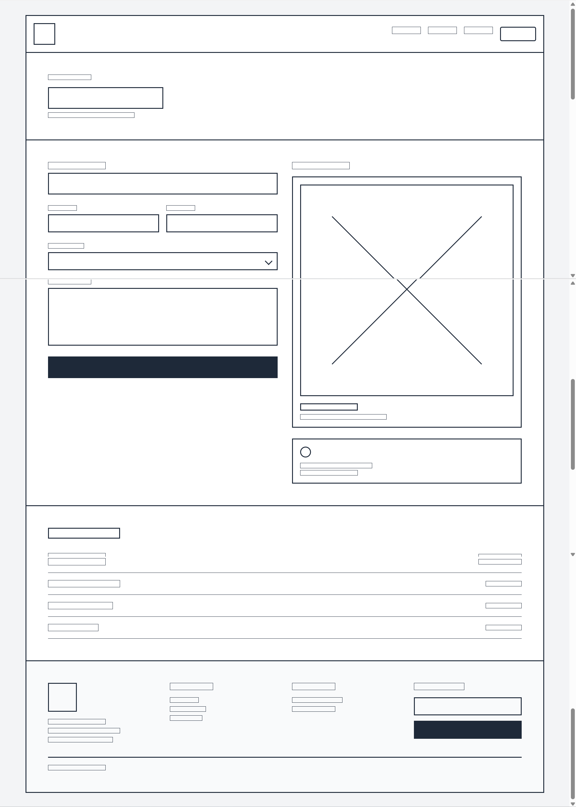
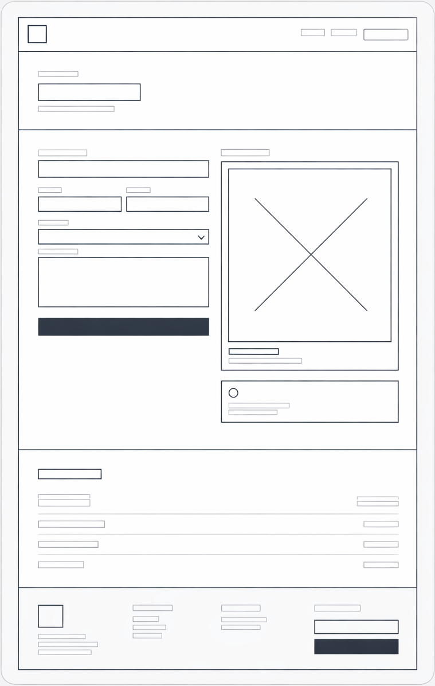
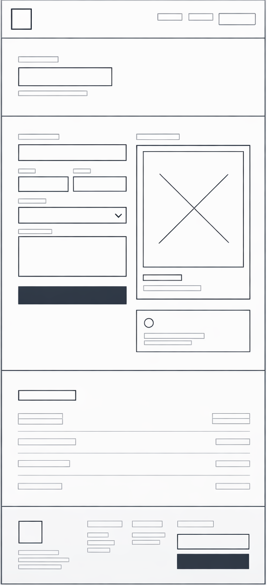

# Wireframes

Dieses Dokument zeigt die Wireframes der wichtigsten Seiten als Bilder für Desktop, Tablet und Mobile. Dazu steht noch Text wie was angepasst wurde auf der Webseite.

---

## Startseite

### Desktop

- Header mit Logo, Navigation und evtl. Herz-Icon
- Grosse Hero-Sektion mit 3D-Illustration und Portfolio-Titel
- Projektvorschau in Kartenform
- Kategorienbereich / Filter
- Footer mit Logo, Navigation, Kontakt und Newsletter

### Tablet

- Kompaktes Layout mit weniger Spalten
- Projektkarten und Kategorien in zwei Spalten oder gestapelten Reihen
- Header bleibt sichtbar, Navigation ist leicht reduziert

### Mobile

- Single-Column-Layout für bessere Lesbarkeit
- Grosses Hero-Element, darunter Projektkarten einzeln
- Kategorien gestaffelt untereinander

---

## Projekte / Portfolio

### Desktop

- Übersichtliche Kartenansicht der Projekte
- Filter / Kategorien oben im Bereich
- Breite Inhaltsfläche mit mehreren Karten nebeneinander

### Tablet

- Zwei Spalten statt drei oder vier
- Karten weiterhin gut lesbar, aber platzsparender angeordnet
- Navigation und Filter oberhalb der Projektliste

### Mobile

- Einspaltige Projektliste
- Karten nehmen die volle Breite ein
- Touch-freundliche Abstände und Buttons

---

## Projekt-Detailseite

### Desktop

- Detailansicht mit grossem Vorschaubild
- Projektinformationen und Beschreibung nebeneinander
- Technische Details und Links sichtbar im sichtbaren Bereich

### Tablet

- Inhalt stärker gestapelt, aber noch mit horizontaler Struktur
- Bild oben, Textabschnitt darunter oder daneben
- Fokus auf Lesbarkeit und klaren Abschnitten

### Mobile

- Vertikale Reihenfolge: Bild, Titel, Beschreibung, Details
- Grosse Schaltflaechen und klarer Textfluss
- Weniger visuelle Elemente, Fokus auf Inhalte

---

## Kontaktseite

### Desktop

- Formular und Kontaktinformationen nebeneinander
- Header mit Navigation, klare Call-to-Action
- Terminbuchung als eigener Abschnitt möglich

### Tablet

- Zwei Spalten oder gestapelte Sektionen
- Formular bleibt zentral, Zusatzinfos daneben
- Mobile-ähnliche Struktur ohne zu viel Platzverlust

### Mobile

- Einspaltiges Kontaktformular
- Klar getrennte Bereiche für Text, Formular und Terminbuchung
- Einfaches Scrolling und grosse Buttons
